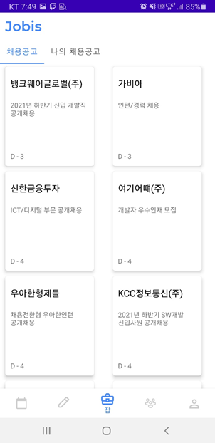

# 취업 도우미 자비스 (Jobis)

SSAFY 5기 대전 2반 B204 안드팀

### 0. 프로젝트 실행 방법

1) [안드로이드 스튜디오 설치](https://developer.android.com/studio?hl=ko&gclid=Cj0KCQiA-eeMBhCpARIsAAZfxZDN0SXk2TsTTOr64AQue5G_-HoNmQyLfqbxzq7TraPXxQasdui0wcoaApdqEALw_wcB&gclsrc=aw.ds)

   - 특별한 설정 할 것 없음

2) 클론한 폴더를 File - Open 에서 열기(폴더 경로에 한글이 있으면 안됨) - Trust Project

3) Tools - AVD Manager 혹은 상단의 실행 부분에서 AVD Manager 들어가기

   

4) Create Virtual Device 선택 후 플레이스토어가 있는 가상 디바이스 선택(ex. Pixel4) - Next

   

5) R 버전 Download 후 Next

6) Finish 후 실행 (shift + F10 혹은 처음 그림의 초록 화살표 클릭)

### 1. 프로젝트 개요

현재 출시된 채용공고 관련 앱을 살펴보면 맞춤 채용정보, 관심 기업 서비스를 제공하고 일부 앱만 채팅 기능이 추가돼 있다. 하지만 취준생들에겐 취업공고 뿐만 아니라 커뮤니티를 통해 서로 정보를 공유하는 것도 굉장히 중요하다. 

위스터디나 열품타와 같은 스터디 관련 앱들도 늘어나는 추세이지만 채용정보는 제공하지 않는다. 본 앱에서는 취준생들의 니즈를 충족시키기 위해서 취업정보 제공과 스터디 서비스를 함께 제공하고, 캘린더와 알람 기능을 통한 일정 관리 기능을 이용하며, 완전한 기능 구현을 위해 다른 부가 기능은 제공하지 않는다.

- 기술/트렌드 동향

  - 취업 준비생의 수는 2015년 이후 꾸준히 증가하여 현재 역대 최고치에 도달하였다. 이에 따라 각종 포털 사이트(잡코리아, 독취사 등)나 어플을 이용한 스터디 모집, 채용 정보 확인이 활발히 이루어지고 있다.
  - 한편 대기업들의 채용 형태는 공채에서 수시 채용으로 대부분 전환되었고, 채용 규모는 코로나 19 빙하기를 넘어 예년 수준으로 회복될 것으로 기대된다. 따라서 채용 정보에 대한 공급 또한 증가할 것으로 전망한다.

- 관련 뉴스

  >[취준생 80만4000명 사상 최대…여전히 공무원이 최고 인기](https://www.joongang.co.kr/article/23830602#home)(2020.07.22)
  >
  >[지난달 취업준비자 85만명·역대 최대… 청년층 취준생 7만명 ↑](https://www.ajunews.com/view/20210321122516242)(2021.03.21)
  >
  >[취준생 86만명 역대 최대...10명중 3명은 공무원 준비](https://www.yna.co.kr/view/AKR20210720080900002)(2021.07.20)
  >
  >[8월 취업준비자 87.4만명 사상 최대...30대 취준생 17% 급증](https://biz.chosun.com/policy/policy_sub/2021/09/22/PWPX6IEM65GKVI5H6I46IBABII/)(2021.09.22)
  >
  >[“작년보다 70% 더 뽑는다”… 삼성 현대차 SK 롯데 대기업 채용문 열린다](https://www.mk.co.kr/news/business/view/2021/10/940464/)(2021.10.04)

- 유사 서비스 사례

  채용 공고 정보 제공하는 어플로 "자소설닷컴" 어플리케이션이 있다. 기업의 채용 공고를 매일 업데이트하여 제공하며, 기업별 채팅방, 마감 기간 알림, 채용일정 관리 등의 여러 서비스를 제공한다.

  모바일 어플리케이션 "열품타"를 유사 사례로 들 수 있다. 열품타는 캘린더의 스터디량을 자동 입력하며, 랭킹 시스템, 영상으로 공부하는 모습을 공유하며 스터디하는 캠 스터디 등의 다양한 서비스를 제공한다.

- 향후 전망

  스터디 계획이나 채용 정보에 따른 일정 관리를 캘린더를 통해 한 눈에 확인하고 관리할 수 있도록 하여 취업스터디 효율을 향상할 수 있다. 또한 스터디원 간 채팅 공간을 통해 소속감과 친밀감을 느낄 수 있다. 추후 서비스 확대시 면접, 자소서 등 취업 전형을 도와줄 수 있는 컨텐츠를 추가하는 것도 기대할 수 있다.

  

## 2. 앱 소개

### 1) 로그인


### 2) 캘린더


- 각 일자에 일정 추가 가능

- 채용 공고를 가져와 쉽게 표시할 수 있음

- 일정 추가 시 알람 설정

- 스터디의 단일 일정과 동기화됨

  

### 3) 일정 추가


- 단일 일정 / 반복 일정으로 구분하여 추가 할 수 있음
- 반복 일정의 경우 주단위, 요일 별로 설정 가능

### 4) 스터디


- 스터디 방 생성 / 검색 / 입장 가능
- 스터디 방 내에서 채팅, 이모티콘 생성 및 전송 가능


### 5) 채용 공고



- 파이어베이스 DB에 저장되어 있는 채용 공고를 가져와 표시

  

### 6) 커뮤니티


- 분류별 / 인기순 / 최신글 등을 확인 가능하며, 제목과 내용으로 검색 기능 제공

### 7) 마이페이지


- 내 활동 기록을 쉽게 확인 가능


## 3. 프로젝트 구조


- 백엔드를 따로 사용하지 않고 파이어베이스만 사용하여 앱을 구현하였음
- 파이어베이스만을 이용하다 보니 속도에 제약이 생김 (개선 사항)
- 개인 일정은 로컬 DB에 ,단체 일정은 파이어스토어에 저장 (개선 사항 - 캐싱)


## 4. 팀원 소개


## 5. Git Convention

### Branch Convention

💡 **master, develop, feature/[feat_name]**

- 위의 3가지 브렌치 사용
  - `master` : 기준이 되는, 배포하는 브랜치
    - `develop`에서만 MR 접근, 직접 수정 및 커밋 금지!
  - `develop` : 각자의 개발 작업을 합치는 중심 브랜치
    - 각 `feature/[feat_name]`에서만 MR 접근, 직접 수정 및 커밋 금지!
  - `feature/[feat_name]` : 단위 기능을 개발하는 브랜치
    - 기능 개발이 완료되면 `develop`에 MR


기능별 브랜치를 나눠 작업 후 develop에 merge


### Commit Convention

💡 `[Commit Type]: [Commit msg]`

```
Example

feat: 로그인 모달 활성화
fix: 회원가입 API 404 해결
docs: README 수정
```

**Commit Types**

- `feat:` 새로운 기능 추가
- `fix:` 버그 수정
- `docs:` 문서 수정
- `style:` 코드 포맷팅, 세미콜론 누락, 코드 변경이 없는 경우
- `refactor:` 코드 리팩토링
- `test:` 테스트 코드, 리펙토링 테스트 코드 추가
- `chore:` 빌드 업무 수정, 패키징 매니저 수정


## 6. 노션 / 와이어프레임 링크

https://www.notion.so/d023176044ee4caaa77242d748788152

https://www.figma.com/file/PULVuQlOPLfk61xS2jBL1g/%EC%9E%90%EC%9C%A8%ED%94%84%EB%A1%9C%EC%A0%9D%ED%8A%B8-team-library
